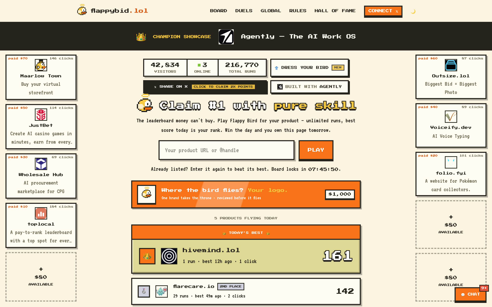
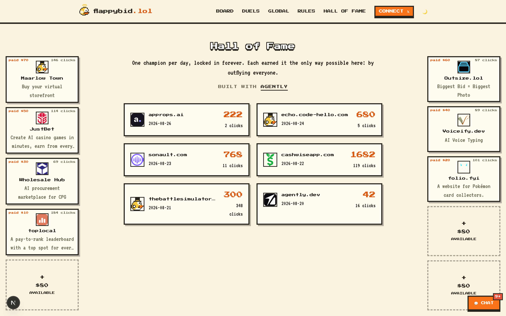
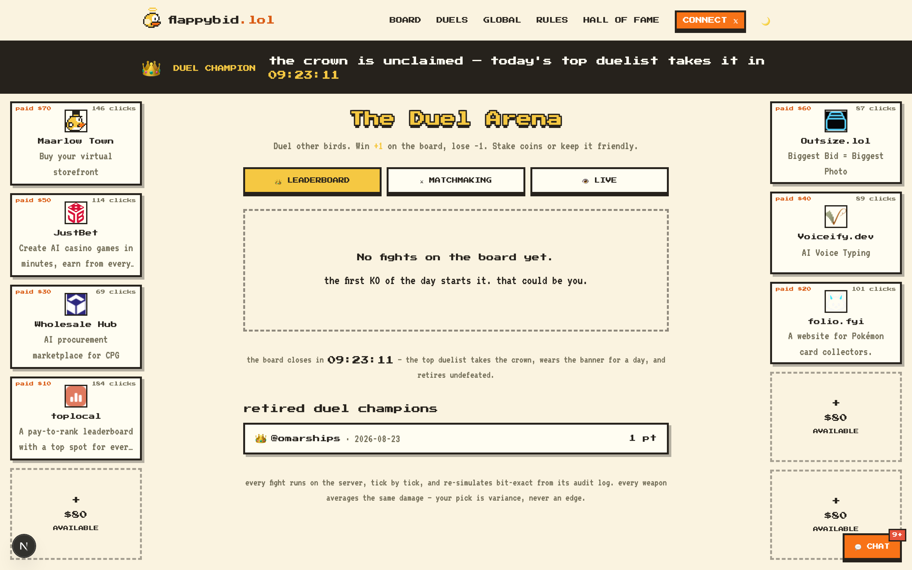
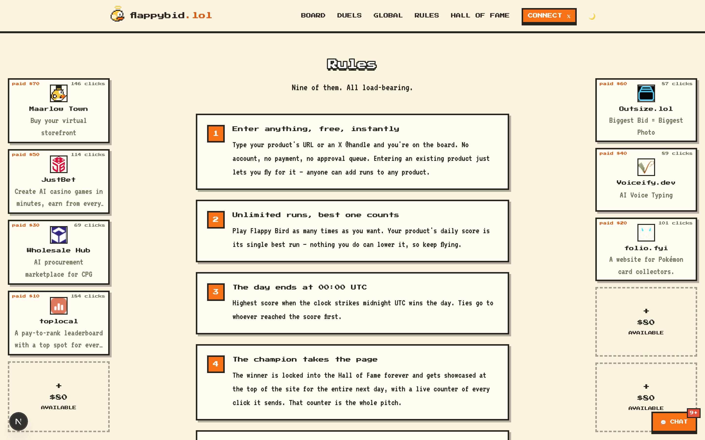

# flappybid

**[flappybid.lol](https://flappybid.lol)** — the leaderboard money can't buy.
Open source under the MIT licence.

Next.js 16 · React 19 · Supabase · TypeScript · Tailwind 4

In its first 72 hours it took **203,137 runs from 41,861 players**, peaking at
**163,502 runs in a single day** — every one of them replayed and verified
server-side by the anti-cheat described below.

## Screenshots

| The board | Hall of Fame |
|---|---|
|  |  |
| **The Duel Arena** | **Rules** |
|  |  |

## Features

**The game**

- Deterministic 60Hz fixed-timestep Flappy Bird. The sim (`src/game/sim.ts`)
  is shared verbatim between client and server — that is what makes the
  anti-cheat possible.
- Nine maps: classic meadow, the gauntlet, drone alley, the reactor, windy
  heights, the cavern, rush hour, moonwalk and the staircase. Several carry
  combat — guns, drones and laser gates you shoot through.
- 8-bit synth soundtrack and SFX, generated in-browser.
- A bird wardrobe with five slots (skin, hat, face, trail, charm), a daily
  fit, and premium pieces unlocked at a best score of 50 / 100 / 200 / 500 /
  1000.
- Revive: spend coins to cheat death once per run.

**The board**

- Enter a product by URL or X @handle, then play unlimited runs. Your best
  score of the UTC day is your rank.
- At 00:00 UTC the day's leader is locked into the Hall of Fame forever and
  showcased site-wide for 24 hours, with a live counter of the outbound
  clicks it sends via `/out/[slug]`.
- A product can win exactly once, then retires undefeated — nobody camps #1.
- All-time global leaderboard alongside the daily board.
- Favicon and X-avatar resolution with a pixel-globe fallback.

**Anti-cheat**

- The server issues the seed; the client returns the frame index of every
  flap; the server replays the run and requires an exact score match.
- A wall-clock floor rejects runs submitted faster than they could be flown.
- A mid-run checkpoint protocol catches tampering before submission.
- Behavioral detectors flag metronome timing, held gap-lines, 30Hz input
  bursts and quantized tap intervals.
- Cross-run profiling in the admin dashboard scores a whole career — warmup
  deaths, fatigue drift, restart cadence, device-cookie churn — and produces
  a ban-confidence verdict a human reviews.
- Cloudflare Turnstile, per-IP rate limits, device cookies, salted IP hashes
  and same-origin checks on every write.

**The Duel Arena**

- Tick-based melee combat over WebSockets, RuneScape-style.
- Blind ghost challenges: record a fight against the practice dummy, post it
  as a ghost, and let others fight it without seeing your moves.
- A weapon rack where every pick averages the same damage — your choice is
  variance, never an edge.
- A daily duel board (+1 a win, -1 a loss, never below zero) whose crown
  retires at midnight, plus open pits, coin wagers and live spectating.
- Every fight re-simulates bit-exact from its audit log.

**Economy**

- Coins tied to a verified X account, bought with card (Stripe) or crypto
  (NOWPayments).
- Sponsor rails: paid slots whose price ratchets with every sale, with a
  buyout mechanic once the board is full.
- A $1,000 logo bid for the hero placement.

**Chat**

- Site-wide panel with a public room and 1:1 DMs.
- GIFs, message effects, per-user pixel-bird avatars, colour-coded names,
  X-verified handles and owner tags.

**Admin**

- `/admin`, gated on verified X handle: traffic and player analytics, board
  bans, ghost-replay review before a champion is crowned, sponsor and chat
  moderation, and site-wide announcements with a preview.

**Platform**

- Next.js 16, React 19, TypeScript, Tailwind 4, on a custom Node server so
  the arena can hold WebSockets.
- Supabase Postgres; migrations auto-apply from CI on push to `main`.
- Daily close via Vercel cron at 00:00 UTC, with a lazy close on first read
  after midnight so a missed cron never loses a champion.
- Server-rendered board, sitemap, robots, OG cards and structured data.
- Light and dark themes.

## Quick start

You need Node 20+ and a free Supabase project.

```bash
git clone https://github.com/AgentlyLabs/flappybid.git
cd flappybid
npm install
cp .env.example .env.local
```

Create a Supabase project, open the SQL editor and run
`supabase/migrations/0001_init.sql`. That one file is the whole schema —
24 tables, plus the functions, policies and indexes they need.

Fill in four values in `.env.local` — everything else in `.env.example` is
optional and gates a feature you can ignore locally:

| variable | where it comes from |
|---|---|
| `NEXT_PUBLIC_SUPABASE_URL` | Supabase → Project Settings → API |
| `SUPABASE_SERVICE_ROLE_KEY` | same page, the `service_role` key |
| `IP_HASH_SALT` | any random string (`openssl rand -hex 32`) |
| `CRON_SECRET` | any random string — guards `/api/close` |

```bash
npm run dev          # http://localhost:3000
npx tsx scripts/test-sim.mts   # prove the sim is deterministic
```

Skipping the optional keys disables, in order: Turnstile bot-checks, Stripe
and NOWPayments sponsor slots, avatar/GIF lookups, and X sign-in. The game,
the board and the anti-cheat all run without them.

---

The leaderboard money can't buy. Enter your product (URL or X @handle), play
Flappy Bird, unlimited runs — your best score today is your rank. At 00:00 UTC
the top product is locked into the Hall of Fame and showcased across the whole
site for the next 24 hours, with a live counter of the clicks it sends. Then it
retires undefeated — one win, ever, so nobody camps #1.

## How the anti-cheat works

- `POST /api/run/start` issues a server-generated seed and creates the run row.
- The client runs a deterministic 60Hz fixed-timestep sim (`src/game/sim.ts`,
  shared verbatim with the server) and records the frame index of every flap.
- `POST /api/run/submit` replays the run server-side from `(seed, flapFrames)`.
  The claimed score must match the replay exactly, and the wall-clock time
  since `run/start` must be at least the sim duration (you can't submit a
  10-minute run in 2 seconds). Anything else is rejected.

Verify determinism locally: `npx tsx scripts/test-sim.mts`

The behavioral detectors on top of the replay (`src/game/detect.ts`, and the
advisory chips in `src/lib/suspicion.ts`) are tuned entirely through the
environment — see `src/game/thresholds.ts` for the knobs. The defaults
committed here are deliberately loose: they catch blatant automation and
little else, which is the right failure mode for a fresh install, since a
missed bot is cheap and a banned human is not. Publishing the bars a
deployment actually runs on would let a solver author sit just outside them,
so tighten yours in env rather than in source.

## Setup

1. **Supabase** — create a fresh project, open the SQL editor, run
   `supabase/migrations/0001_init.sql`.

   Later migrations apply automatically: `.github/workflows/migrate.yml` runs
   `supabase db push` on every push to `main` that touches
   `supabase/migrations/`. It needs two GitHub repo secrets:
   `SUPABASE_ACCESS_TOKEN` (supabase.com/dashboard/account/tokens) and
   `SUPABASE_DB_PASSWORD` (the project's database password).
2. **Env** — fill `.env.local` with the project URL, the `service_role` key
   (Project Settings → API keys), and a random `CRON_SECRET`
   (see `.env.example`).
3. `npm install && npm run dev`

### Deploy (Vercel)

- Add the same env vars to the Vercel project.
- `vercel.json` schedules `/api/close` at 00:00 UTC daily (Vercel sends
  `CRON_SECRET` as the Bearer token automatically). The close is also lazily
  triggered by the first leaderboard read after midnight, so a missed cron
  never loses a champion.

### Sponsor slots (optional)

9 slots, one-time payment, live for a month, price ratchets +$100 per slot
sold. Set `STRIPE_SECRET_KEY` and `STRIPE_WEBHOOK_SECRET` (webhook endpoint:
`/api/stripe/webhook`, event: `checkout.session.completed`). Paid slots land
as `status = 'pending'`; flip them to `'live'` in the dashboard after review.

## Daily lifecycle

- Day = UTC calendar day. Board shows today's `daily_scores`; best score wins,
  ties broken by who got there first.
- `/api/close` (or the lazy close) writes `hall_of_fame` (one row per date,
  forever) and stamps the product's `last_won_on`, which permanently retires
  it — enforced at `run/start` and `enter`.
- Yesterday's champion is showcased on the home page; its outbound clicks go
  through `/out/[slug]`, which counts them into `hall_of_fame.clicks_sent`.

## Contributing

Issues and pull requests welcome. Before opening a PR that touches the
simulation, run `npx tsx scripts/test-sim.mts` — the client and server share
`src/game/sim.ts` verbatim, so any change to it that breaks determinism
invalidates every stored replay.

## Licence

MIT — see [LICENSE](LICENSE).
